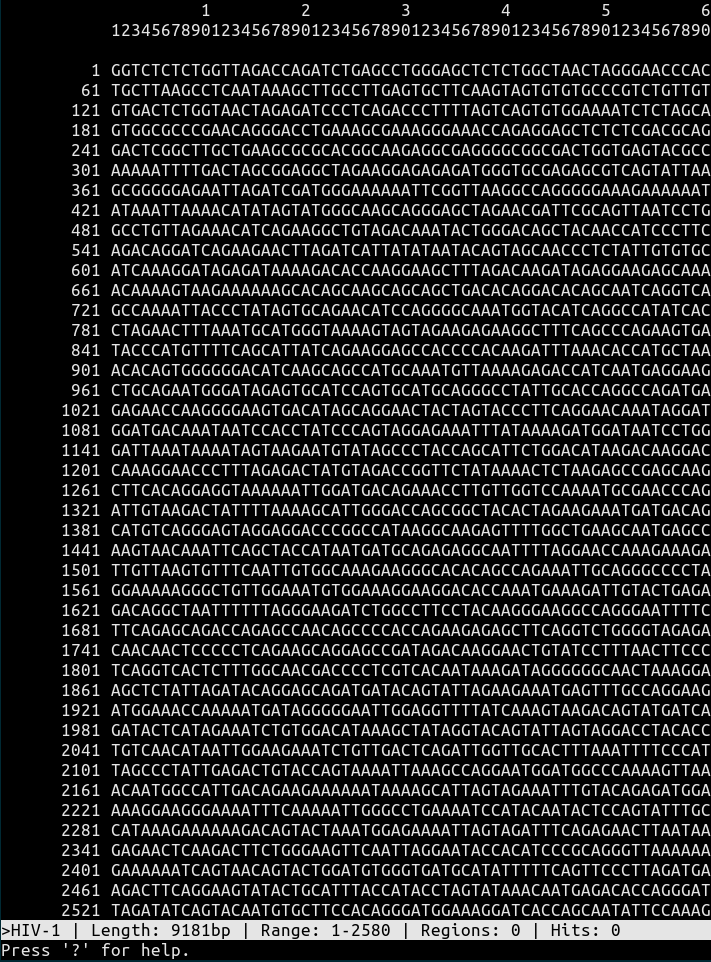

# fiat
FASTA In A Terminal

## Introduction

*fiat.py* is a text-mode viewer for DNA sequences read from FASTA files.
It offers a powerful search feature that allows for mismatches and ambiguous
bases, and the ability to define regions in the sequence, characterized by
a color and a name.

Fiat can handle multiple sequences at the same time, and allows switching between
sequences at any time. Search results and regions are specific to each sequence.

## Startup

The fiat.py command line is:

```bash
$ fiat.py fastafiles...
```

where fastafiles represents one or more files in FASTA format. Files can contain
multiple sequences. Each sequence contained in the input files will be loaded
into fiat. The program will then display the contents of the first loaded sequence,
starting at position 1.

## Display

The fiat.py display is divided into four regions:

* The top three rows contain the ruler, showing base positions from 1 to 60, followed
by an empty line.

* The rest of the screen, except for the last two rows, contains the sequence. The format
of each line is: position of the first base in the line, 60 bases, and optionally the name
of all hits and all regions present in the line.

* The last-but-one row (in reverse) is the status row. It displays the name of the currently displayed
sequence, its length, the range of bases currently visible, the number of define regions
and the number of hits (see Regions and Searching below).

* The last row is the /message/ row. It is used to display messages or to accept user input.

The following image shows an example of what the display looks like:



## Usage

When displaying a sequence, use the '?' key to display all available commands. Use the 'q' command
to quit the program.

## Basic commands

You can use the arrow keys, Home/End, PgUp/PgDn, Enter and Spacebar to navigate through the sequence.
Left arrow scrolls back by 10 lines, right arrow scrolls forward by 10 lines.

The 'g' key (for 'go to') asks for a position in the sequence, and scrolls the display so that the
line containing that position is at the top of the screen.

The 's' key prints some statistics on the sequence in the message row. Currently these consists of
the counts and percentages for each base, and the GC%.

The 'o' key is used to set options. Currently these are:
* The maximum number of mismatches allowed in a search (with the 'm' key);
* The search mode (with the 's' key) - this can be any combination of the four letters f, r, c, d,
  meaning forward, reverse, complement, and reverse-complement respectively. For example, if the mode
  is 'fr' the program will search for sequences in both forward and reverse orientations. See the Searching
  section for more details. 

## Regions

Regions are arbitrary subsequences characterized by a start and end position,
a name, and a color. Regions can be defined manually (using the `a' key) or
as a result of a search. Use < and > to focus the previous / next region
respectively. When a region is focused, the message line starts with `* Region'
and shows the number of the current region and its coordinates.

Key | Command
----|--------
        <, >         | jump to previous / next region
        r            | rename the currently focused region
        c            | change color of the currently focused region
        d            | delete the currently focused region

The following five colors can be used for regions, identified by their initial:
(r)ed, (g)reen, (b)lue, (m)agenta, (c)yan
